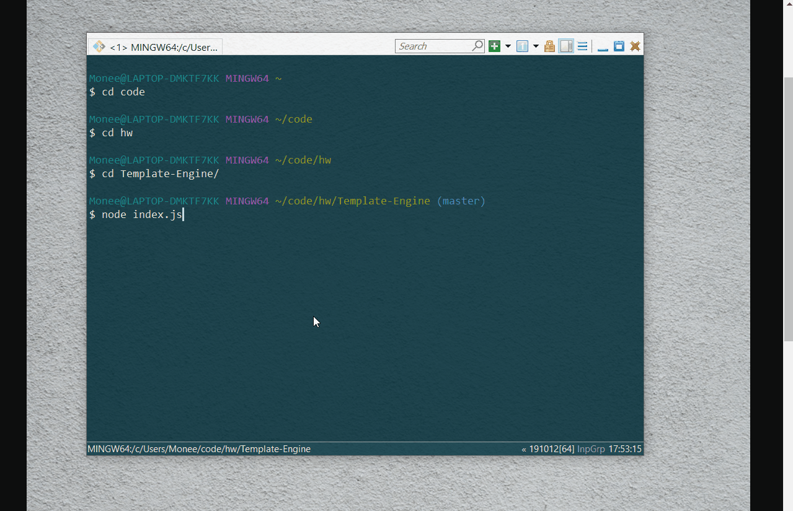

# Template-Engine

## Description
This is a software engineering team generator command line application. The application prompts the user for information about the team manager and then information about the team members. The user can input any number of team members, and they may be a mix of engineers and interns. When the user has completed building the team, the application will create an HTML file that displays a nicely formatted team roster based on the information provided by the user. 

## Table of Contents
* [Installation](#installation)
* [Technologies-Libraries](#technologies-libraries)
* [Demo](#demo)
* [Credits](#credits)

## Installation
In your terminal type:
```git clone https://github.com/verlitas/Template-Engine.git```
* Open in Visual Studio to build and run.
* For further instructions, visit https://help.github.com.

## Technologies-Libraries
JavaScript - Node.js - Inquirer - HTML 

## Demo


## Credits
[Melody Kirshberg](https://github.com/verlitas)  
[UABootCamp](https://bootcamp.ce.arizona.edu/coding/)
